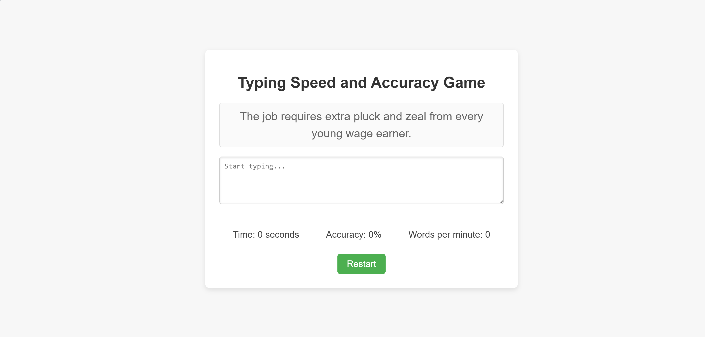

# TypeNinja

This is a simple typing game that measures typing speed and accuracy. Users are given a random sentence to type, and the game tracks the time taken, typing accuracy, and words per minute.

## Features

- Randomly selects one of 20 sentences for the user to type.
- Tracks and displays the time taken to type the sentence.
- Calculates and displays typing accuracy as a percentage.
- Calculates and displays words per minute (WPM).
- Prevents the use of the backspace key to enhance typing practice.
- Provides a clean, modern UI with responsive design.

## Technologies Used

- HTML
- CSS
- JavaScript

## Installation

1. Clone the repository:
   ```bash
   git clone https://github.com/yourusername/typing-game.git
   ```
2. Navigate to the project directory:
   ```bash
   cd typing-game
   ```

## Usage

1. Open `index.html` in your web browser to start the game.
2. Start typing the displayed sentence in the text area.
3. The game will track your typing speed, accuracy, and words per minute.
4. Click the "Restart" button to try again with a new sentence.

## Files

- `index.html`: The main HTML file containing the structure of the game.
- `styles.css`: The CSS file for styling the game.
- `script.js`: The JavaScript file for the game logic.

## Screenshot



## License

This project is licensed under the MIT License. See the [LICENSE](LICENSE) file for details.

## Contributing

Contributions are welcome! Please feel free to submit a Pull Request.

## Contact

If you have any questions or feedback, feel free to contact me at [sms10221@nyu.edu](mailto:sms10221@nyu.edu).


### Explanation of Sections

- **Features**: Lists the main features of the game.
- **Technologies Used**: Specifies the technologies used in the project.
- **Installation**: Provides instructions on how to clone and navigate to the project directory.
- **Usage**: Explains how to use the game.
- **Files**: Describes the purpose of each file in the project.
- **Screenshot**: Placeholder for a screenshot of the game.
- **License**: Mentions the license under which the project is distributed.
- **Contributing**: Encourages contributions and explains how to submit a Pull Request.
- **Contact**: Provides contact information for any questions or feedback.

Feel free to customize the content as needed, especially the sections for **Contact** and **Contributing**. If you add a screenshot, save it as `screenshot.png` in the project directory and it will be displayed in the README.